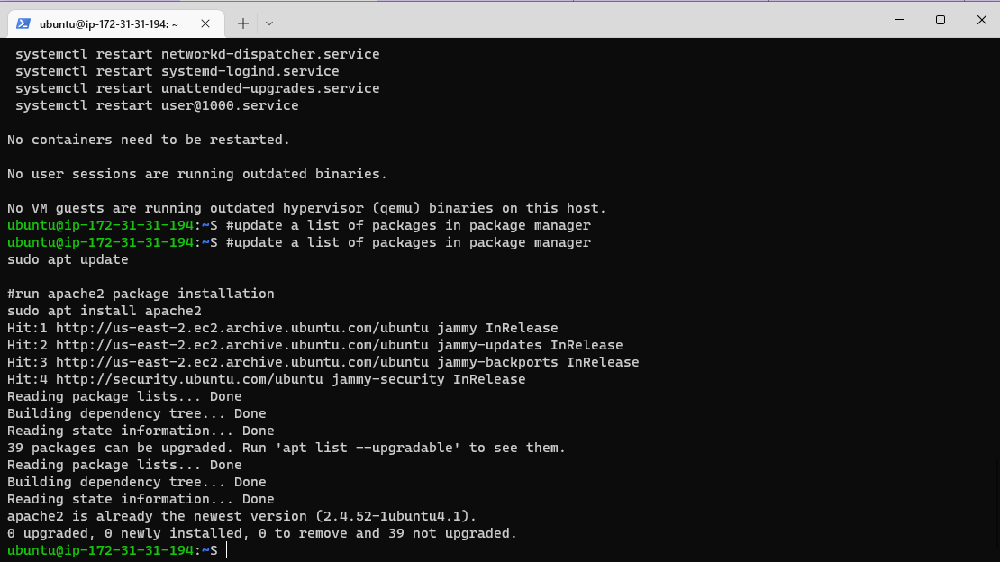
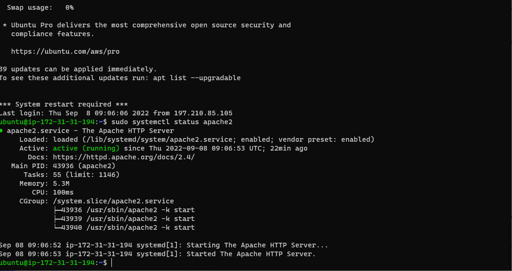
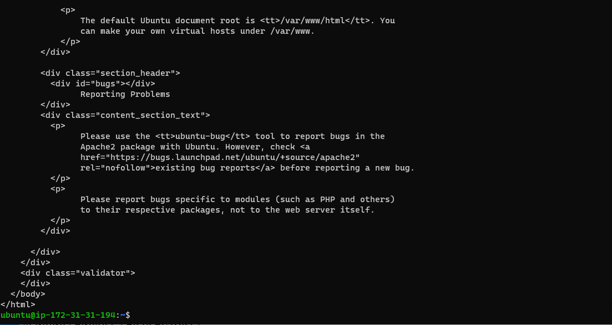
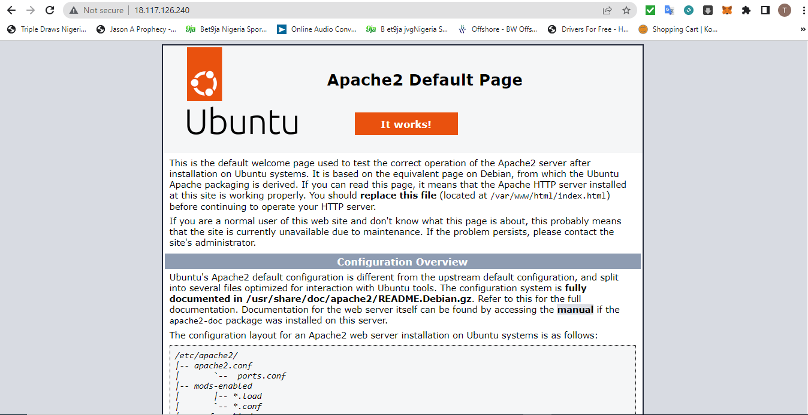
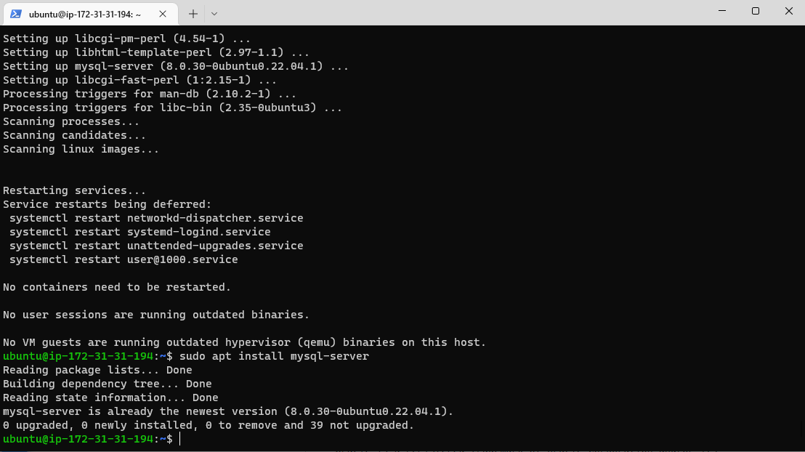
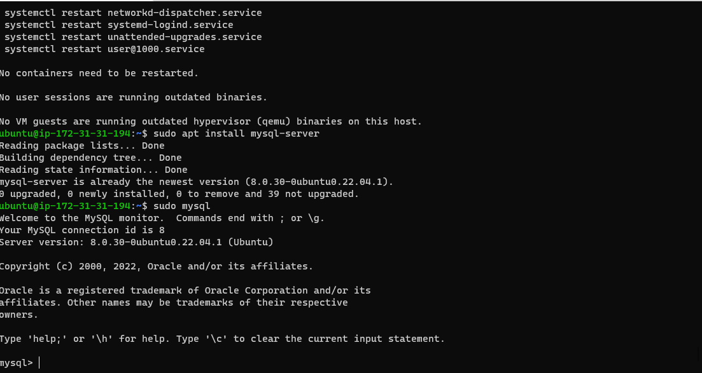
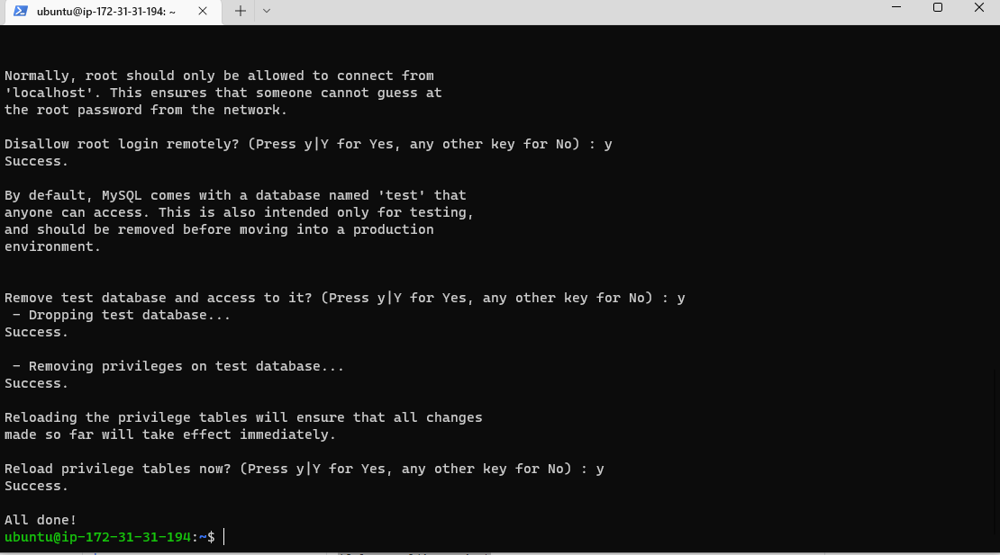

### DOCUMENTATION OF PROJECT 1

## STEP 1
`INSTALLING APACHE AND UPDATING FIREWALL`

` To verify that apache2 is running as a Service in our OS`

`Access  Ubuntu Shell locally after enabling Port 80`

`Result of Apache HTTP server respond to requests from the Internet.`

## STEP 2
`INSTALLING MYSQL`

`Logged into MYSQL`

`Starting Interactive Script By By Runnung MYSQL Secure installation`

`Login to MYSQL With Sudo mysql -p`

## STEP 3
`INSTALLING PHP  (sudo apt install php libapache2-mod-php php-mysql)`

## STEP 4
`CREATING A VIRTUAL HOST FOR YOUR WEBSITE USING APACHE`

`Using a2ensite command to enable the new virtual host:`

`Create an index.html file in that location so that we can test that the virtual host works as expected:`

## STEP 5
`ENABLE PHP ON THE WEBSITE`

